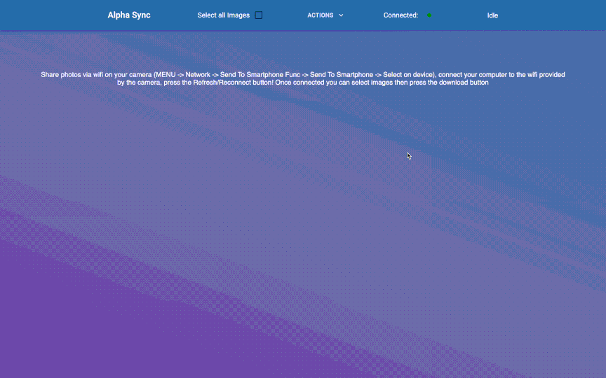

# Alpha Sync

An application to download images from Sony Alpha Cameras for ARM Mac Computers.


## Tech Stack

React, Electron, NPM, MaterialUI


## Contributing

Contributions are always welcome!

Submit a pull request!


## Installation

Install using the latest .dmg under the releases tab.

    
## Demo




## Features

- Connect to camera via wifi
- Thumbnail preview
- Download selection of images
- Works on ARM Macs (to my knowledge Imaging Edge Desktop doesn't yet)
- Tested with Sony Alpha 6100


## Lessons Learned

What did you learn while building this project? What challenges did you face and how did you overcome them?
- Learned about Inter Process Commuinication and why isolating the node and renderer processes are important
- Learned how to publish via github actions and that it is easier to publish for the platform that the runner is using (github doesnt host mac ARM runners yet so has to self publish and package)
- Refined my knowledge of React and CSS 
- First time using MaterialUI
- Learned how to use React with Typescript
- Learned about Skeleton Images to ease loading stress on the user
- Refined knowledge of Promises especially when communicating between two different processes


## Starting Development

Start the app in the `dev` environment:

```bash
npm start
```

## Packaging for Production

To package apps for the local platform:

```bash
npm run package
```

## Roadmap

- Download only missing images


<a href="https://www.flaticon.com/free-icons/photograph" title="photograph icons">Photograph icons created by kank - Flaticon</a>
